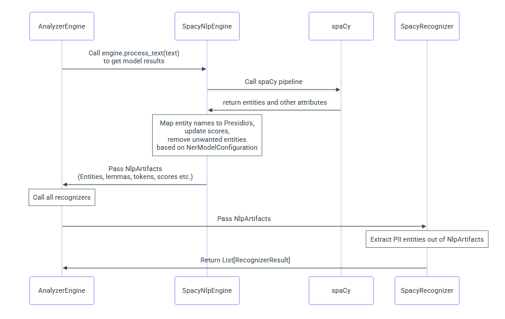
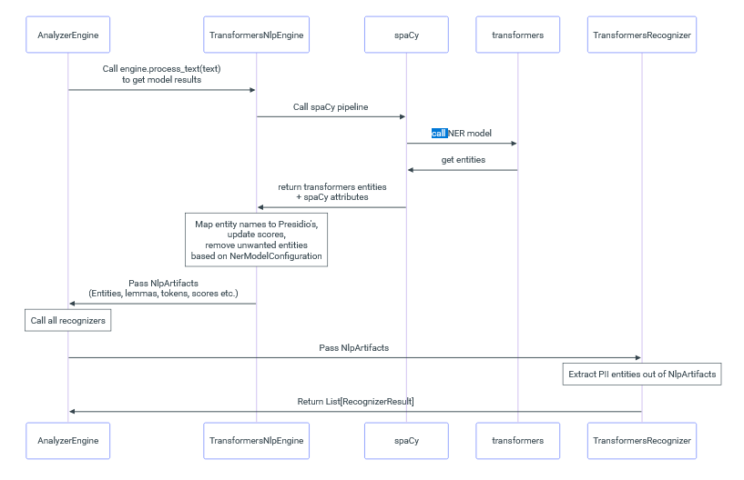

# Architectuur: Modulaire Presidio-NL

## Overzicht

De applicatie bestaat uit een API (FastAPI) en CLI voor tekst-anonimisering, waarbij het onderliggende taalmodel (NLP-engine) eenvoudig verwisselbaar is. De architectuur is zo opgezet dat SpaCy als standaardmodel wordt gebruikt, maar dat andere modellen (zoals HuggingFace transformers) eenvoudig kunnen worden toegevoegd via een abstractielaag en configuratie.

## Componenten

- **API (FastAPI):** Biedt endpoints voor analyse en anonimisering van tekst.
- **Anonymizer:** Kernlogica voor detectie en anonimisering van PII.
- **NLP-engine abstractie:** Interface en implementaties voor verschillende NLP-backends (SpaCy, transformers, ...).
- **Custom recognizers:** Eigen recognizers voor Nederlandse PII (zoals BSN, IBAN, etc.).
- **Configuratie:** YAML-bestanden bepalen welk model en welke recognizers geladen worden.
- **Docker:** Containerisatie voor eenvoudige deployment en reproduceerbaarheid.

## NER flow

Flow diagram van de NER (Named Entity Recognition) processen in de applicatie:

SpaCy only: \

SpaCy plus transformers: \

## Modelkeuze

- De keuze van het NLP-model gebeurt via een configuratiebestand (`conf/spacy.yaml`, `conf/transformers.yaml`, ...).
- Bij opstarten leest de applicatie deze config en laadt de juiste NLP-engine.
- De rest van de applicatie (API, anonymizer) gebruikt alleen de abstracte interface en is onafhankelijk van het gekozen model.
OPTIES:
- [NER Dutch](https://huggingface.co/flair/ner-dutch) (500GB)
- [NER Dutch Large](https://huggingface.co/flair/ner-dutch-large/tree/main) (2.2GB)

## Uitbreidbaarheid

- Nieuwe modellen kunnen worden toegevoegd door een nieuwe engine-implementatie te maken en een config toe te voegen.
- Nieuwe recognizers kunnen als losse Python-modules worden toegevoegd en via config of code worden geregistreerd.

## Voordelen

- **Flexibel:** Snel wisselen tussen modellen zonder codewijzigingen.
- **Herbruikbaar:** Zelfde API voor alle modellen.
- **Onderhoudbaar:** Duidelijke scheiding tussen infrastructuur, logica en modelkeuze.

---

Zie ook `docs/migratieplan.md` voor de migratiestappen en `docs/uitbreiden.md` voor instructies om nieuwe modellen of recognizers toe te voegen. 